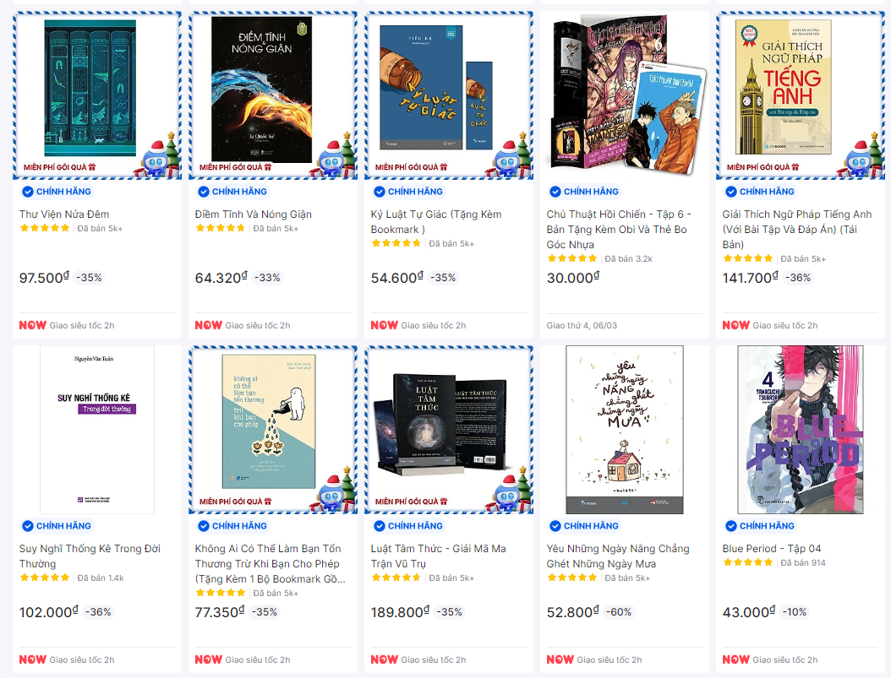
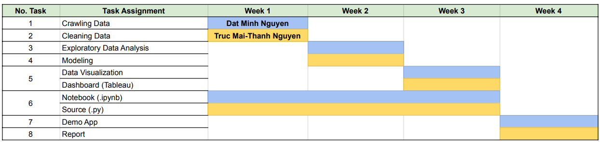

Predicting Discount Rates of Tiki Products - Exploratory Data Analysis and Visualization
==============================

<p>
    <small><b>Data Analysis and Visualization Project</b><br>
    Faculty of Information Science and Engineering, University of Information Technology <br>
    Vietnam National University, Ho Chi Minh City, Vietnam<br>
</p>

## Contributors

|Student ID|Name     |  Contact Information|
|-----|------------------|---------------------------------------|
|21522721|Truc Mai-Thanh Nguyen| truc.ngmaithanh@gmail.com  or 21522721@gm.uit.edu.vn|
|21521937|Dat Minh Nguyen |     nguyenminhdatyasuo@gmail.com    or 21521937@gm.uit.edu.vn|


-------------------------------
Project Description: 
------------------------------
In this project, we aim to develop a predictive model to forecast the discount rates of products available on the popular e-commerce platform Tiki. With the abundance of online shopping options, consumers are often on the lookout for the best deals, and businesses need to strategically manage their pricing and promotional strategies. By predicting the discount rates of products, we can provide valuable insights to both consumers and businesses, enabling informed decision-making and optimization of various aspects of the retail process.


Dataset 
-------------------------------
| Attribute         | Description                                                                                      |
|-------------------|--------------------------------------------------------------------------------------------------|
| Product ID        | The unique identifier for each product.                                                          |
| Name              | The name of the product.                                                                         |
| Link Product      | The hyperlink leading to the product.                                                            |
| Store             | The name of the store selling the product.                                                       |
| Price             | The discounted price of the product.                                                             |
| Original Price    | The original price of the product.                                                               |
| Discount          | The amount of discount applied to the product.                                                   |
| Discount Rate     | The percentage decrease in price from the original to the discounted price.                       |
| Rating            | The customer satisfaction rating on a scale from 1 to 5.                                          |
| Review Count      | The number of customer reviews for the product.                                                   |
| Type              | The type of product, simple or configurable.                                                      |
| Quantity Sold     | The quantity of the product sold.                                                                 |
| Author Name       | The name of the author for books.                                                                 |
| Short Description| A brief description of the product.                                                               |
| Publisher         | The name of the publisher for books.                                                              |
| Publication Date  | The publication date of books.                                                                    |
| Translators       | The name of the translator for books.                                                             |
| Number of Pages   | The number of pages in a book.                                                                    |
| Categories        | The categories or genres of books.                                                                                                                                     |
| is_authentic      | Indicates whether the product is authenticated.                                                   |
| has_buynow        | Indicates whether the product is available for purchase.                                          |
| Has Book          | Indicates whether the product is a book.                                                          |
| Gift Item Title   | Title of any accompanying gift item.                                                              |
| Stock Item        | Initial stock quantity of books.                                                                  |


Methods Used
------------
* Statistics
* Machine Learning
* Data Collection/Web-Scraping
* Exploratory Data Analysis
* Data Visualization


Project Organization
------------
```
■ tiki_discount_rate
    ■ .gitignore
    ■ data
        ■ preprocessor.pkl
        ■ processed
            ■ .gitkeep
            ■ Data_Tiki_Cleaned.csv
        ■ raw
            ■ .gitkeep
            ■ Data_Tiki_Raw.xlsx
        ■ raw.csv
        ■ test.csv
        ■ train.csv
    ■ visualization
        ■ boxplot.png
        ■ category_discount_rate_relationship.png
        ■ correlation_matrix.png
        ■ discount_rate_over_years.png
        ■ distribution.png
        ■ price_range_discount_rate.png
        ■ rating_discount_rate.png
        ■ top_10_big_store.png
        ■ top_10_highest_discount_rate_products.png
        ■ top_10_highest_discount_stores.png
        ■ top_products_sold_discount_rate.png
    ■ images
        ■ tiki_book.png
        ■ timeline.png
    ■ models
        ■ .gitkeep
        ■ model.pkl
    ■ reports
        ■ .gitkeep
        ■ figures
            ■ .gitkeep
    ■ catboost_info
        ■ catboost_training.json
        ■ learn
            ■ events.out.tfevents
        ■ learn_error.tsv
        ■ time_left.tsv
        ■ tmp
    ■ notebooks
        ■ .gitkeep
        ■ 1. Crawling Data.ipynb
        ■ 2. Cleaning Data.ipynb
        ■ 3. Exploratory-Data-Analysis.ipynb
        ■ 4. Modeling.ipynb
    ■ src
        ■ components
            ■ data_ingestion.py
            ■ data_transformation.py
            ■ data_visualization.py
            ■ model_trainer.py
            ■ __init__.py
        ■ exception.py
        ■ logger.py
        ■ utils.py
        ■ __init__.py
    ■ README.md
    ■ LICENSE
    ■ Makefile
    ■ requirements.txt
    ■ test_environment.py
    ■ setup.py
    ■ main.py
```
Clone the Repository
------------------
```
git clone https://github.com/truc-nmt/tiki_discount_rate.git
```
Test Environment (python/python3)
-----------------
```
python test_environment.py
```
Install Packages 
-----------------
```
pip install -r requirements.txt
```
Run Code
-----------------
```
python main.py
```

Results Comparision on Test set
-----------------------------
|Model|R2 Score|MSE|MAE|
|--------|------|----|---|
|Random Forest|0.985|2.079|0.784|
|Decision Tree|0.676|43.638|4.534|
|Gradient Boosting|0.894|14.242|2.803|
|Linear Regression|0.618|51.583|5.629|
|__XGBRegressor__|__0.992__|__1.067__|__0.658__|        
|CatBoosting Regressor|0.971|3.890|1.355|
|AdaBoost Regressor|0.894|14.211|2.843|

<!-- Visualization
------------------------------------


 -->


Task Assignments Responsibility
-----------------------------------

<b>Project Duration: 4 Weeks </b>(From 26th November, 2023 to 27th December, 2023)



|__No. of Task__|__Task__|__Resposibility Member__|
|---------------------------|----|----------------------|
|1|Crawling Data|Dat Minh Nguyen|
|2|Cleaning Data|Truc Mai-Thanh Nguyen|
|3|Exploratory Data Analysis|Dat Minh Nguyen|
|4|Modeling|Truc Mai-Thanh Nguyen|
|5|Data Visualization <br> Dashboard (Tableau)|Dat Minh Nguyen <br> Truc Mai-Thanh Nguyen|
|6|Notebook (.ipynb)<br>Source (.py)|Dat Minh Nguyen <br> Truc Mai-Thanh Nguyen|
|7|Demo App|Dat Minh Nguyen|
|8|Report|Truc Mai-Thanh Nguyen|


-------------------


